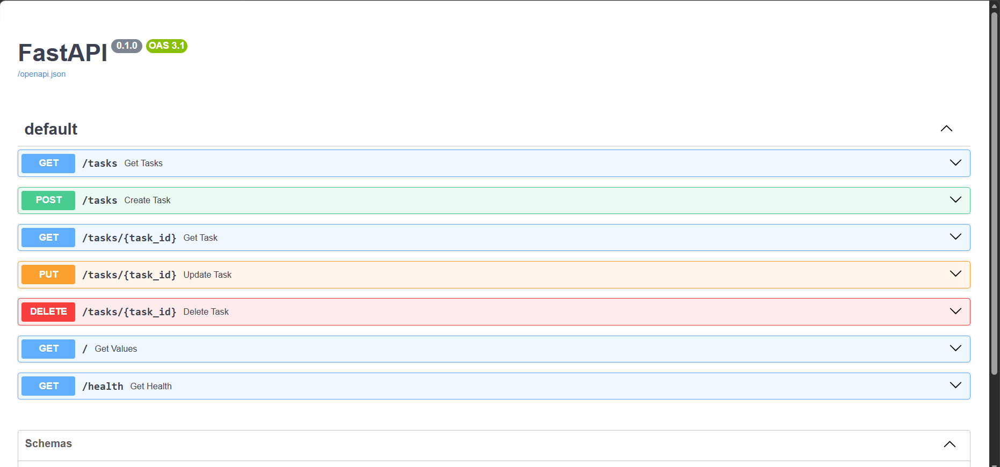
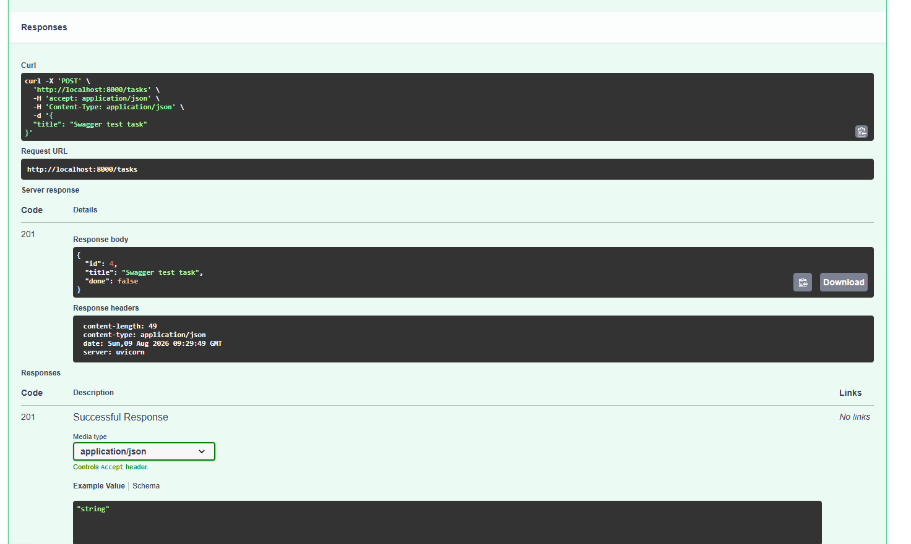
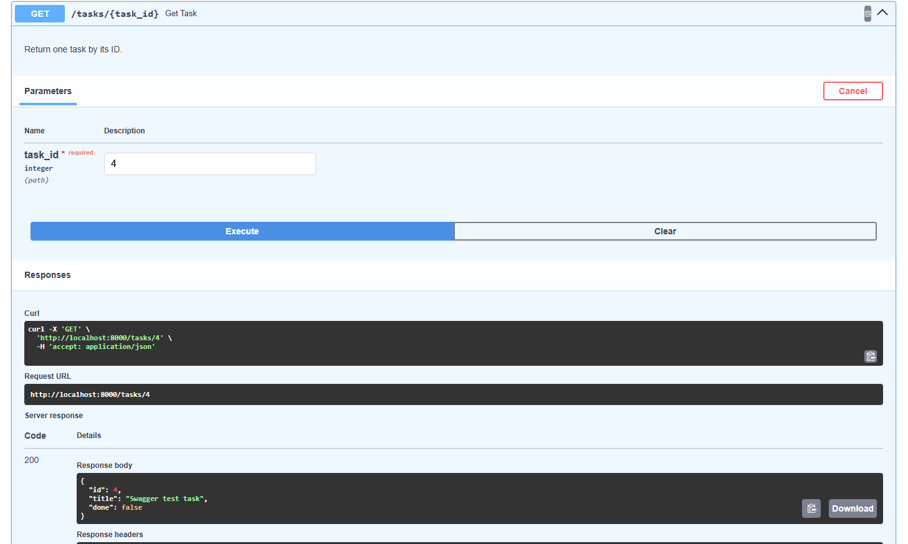
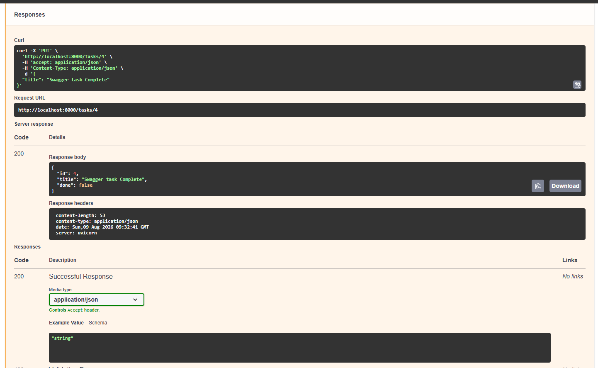
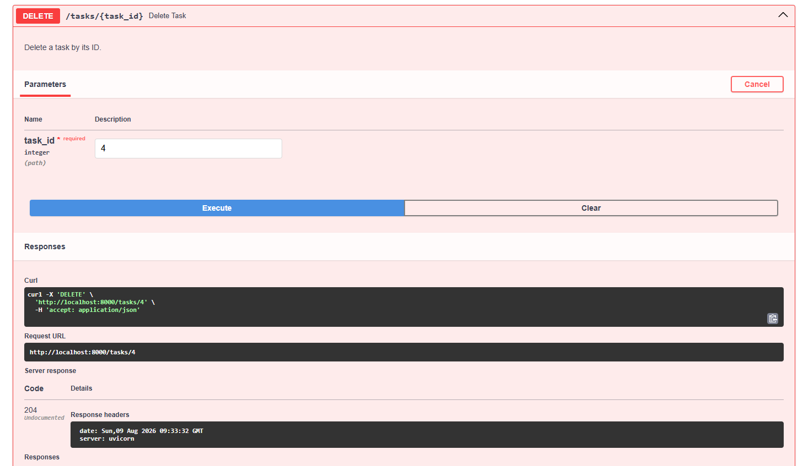
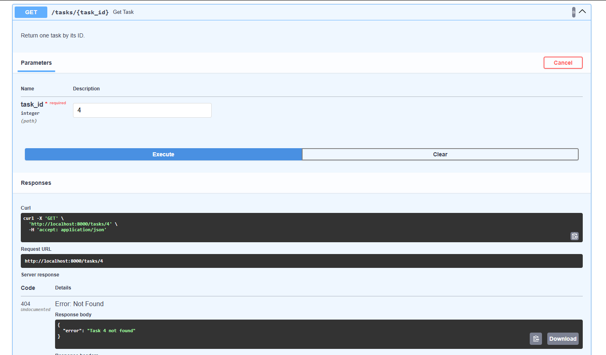

# Task CRUD API

A beginner-friendly REST API built with **Python** and **FastAPI** for managing an in-memory to-do list.

This project was developed as part of the **FlyRank Backend AI Engineering Internship – Week 2** to practice HTTP, CRUD operations, status codes, request validation, Swagger UI, Git, and GitHub.

---

## Features

- Create new tasks
- List all tasks
- Get a task by ID
- Update a task title and/or completion status
- Delete tasks
- Input validation
- JSON error responses
- Appropriate HTTP status codes
- Health check endpoint
- Interactive Swagger UI documentation
- In-memory task storage

> **Note:** Data is stored in memory only. Restarting the server resets the task list.

---

## Tech Stack

- Python 3.12
- FastAPI
- Uvicorn
- JSON
- Swagger UI / OpenAPI
- Git
- GitHub

---

## Project Structure

```text
flyrank-crud-api/
│
├── main.py
├── requirements.txt
├── README.md
├── .gitignore
│
└── screenshots/
    ├── swagger-overview.png
    ├── swagger-create-201.png
    ├── swagger-read-200.png
    ├── swagger-update-200.png
    ├── swagger-delete-204.png
    └── swagger-delete-confirm-404.png
```

---

## Installation

### 1. Clone the repository

```bash
git clone https://github.com/Abdullah-Javed-01/FlyRank-Backend-AI-Engineering.git
cd FlyRank-Backend-AI-Engineering/Week-02/CRUD-API
```

### 2. Create a virtual environment

```bash
python -m venv .venv
```

### 3. Activate the virtual environment

#### Windows PowerShell

```powershell
.\.venv\Scripts\Activate.ps1
```

#### macOS / Linux

```bash
source .venv/bin/activate
```

### 4. Install dependencies

```bash
pip install -r requirements.txt
```

---

## Running the API

Start the development server with:

```bash
uvicorn main:app --reload
```

The API will run at:

```text
http://localhost:8000
```

Swagger UI will be available at:

```text
http://localhost:8000/docs
```

---

## API Endpoints

| Method | Endpoint | Description | Success Status |
|---|---|---|---|
| `GET` | `/` | Return basic information about the API | `200 OK` |
| `GET` | `/health` | Check whether the API is running | `200 OK` |
| `GET` | `/tasks` | Return all tasks | `200 OK` |
| `GET` | `/tasks/{task_id}` | Return one task by ID | `200 OK` |
| `POST` | `/tasks` | Create a new task | `201 Created` |
| `PUT` | `/tasks/{task_id}` | Update a task title and/or done status | `200 OK` |
| `DELETE` | `/tasks/{task_id}` | Delete a task | `204 No Content` |

---

## HTTP Status Codes

The API uses the following status codes:

| Status Code | Meaning |
|---|---|
| `200 OK` | Request completed successfully |
| `201 Created` | A new task was successfully created |
| `204 No Content` | Task was successfully deleted |
| `400 Bad Request` | Invalid or empty request body |
| `404 Not Found` | Requested task does not exist |

Example error response:

```json
{
  "error": "Task 99 not found"
}
```

---

## Create a Task

Send a `POST` request to:

```text
POST /tasks
```

Example request body:

```json
{
  "title": "Buy milk"
}
```

The server automatically:

- generates the next available task ID
- sets `done` to `false`

Example response:

```json
{
  "id": 4,
  "title": "Buy milk",
  "done": false
}
```

---

## Read Tasks

### Get All Tasks

```text
GET /tasks
```

Example response:

```json
[
  {
    "id": 1,
    "title": "Task 1",
    "done": false
  },
  {
    "id": 2,
    "title": "Task 2",
    "done": true
  }
]
```

### Get One Task

```text
GET /tasks/1
```

Example response:

```json
{
  "id": 1,
  "title": "Task 1",
  "done": false
}
```

If the task does not exist:

```json
{
  "error": "Task 99 not found"
}
```

---

## Update a Task

Send a `PUT` request to:

```text
PUT /tasks/{task_id}
```

The client can update the title, done status, or both.

Example:

```json
{
  "title": "Finish FlyRank CRUD API",
  "done": true
}
```

Partial updates are also supported:

```json
{
  "done": true
}
```

An empty request body returns:

```text
400 Bad Request
```

---

## Delete a Task

Send:

```text
DELETE /tasks/{task_id}
```

A successful deletion returns:

```text
204 No Content
```

Trying to access the deleted task afterward returns:

```text
404 Not Found
```

Example:

```json
{
  "error": "Task 4 not found"
}
```

---

## Example curl Request

Example `curl` request used to create a task:

```bash
curl -i -X POST http://localhost:8000/tasks \
  -H "Content-Type: application/json" \
  -d '{"title":"Buy milk"}'
```

Example response:

```text
HTTP/1.1 201 Created
server: uvicorn
content-type: application/json

{"id":4,"title":"Buy milk","done":false}
```

---

## Swagger UI

FastAPI automatically generates interactive API documentation through Swagger UI.

Swagger is available at:

```text
http://localhost:8000/docs
```

The full CRUD cycle was tested through both **curl** and **Swagger UI**.

---

## Swagger API Overview

All API endpoints are visible and testable from the Swagger interface.



---

## Create Task — 201 Created

A new task was created through Swagger UI.



---

## Read Task — 200 OK

The newly created task was retrieved successfully.



---

## Update Task — 200 OK

The task was updated using the `PUT` endpoint.



---

## Delete Task — 204 No Content

The task was deleted successfully.



---

## Confirm Deletion — 404 Not Found

After deletion, requesting the same task returns `404 Not Found`.



---

## CRUD Flow

The API implements the four core CRUD operations:

```text
Create → POST /tasks

Read   → GET /tasks
         GET /tasks/{task_id}

Update → PUT /tasks/{task_id}

Delete → DELETE /tasks/{task_id}
```

The full flow was tested as:

```text
POST   → 201 Created
GET    → 200 OK
PUT    → 200 OK
DELETE → 204 No Content
GET    → 404 Not Found
```

---

## Input Validation

### POST Validation

A task must contain a non-empty string title.

Valid:

```json
{
  "title": "Learn FastAPI"
}
```

Invalid:

```json
{}
```

Invalid:

```json
{
  "title": "   "
}
```

Invalid requests return:

```text
400 Bad Request
```

The server controls the initial `done` value and always creates new tasks with:

```json
{
  "done": false
}
```

---

## PUT Validation

The update body must include at least one of:

- `title`
- `done`

The title must be a non-empty string.

The `done` value must be a boolean.

For example:

```json
{
  "done": true
}
```

is valid.

But:

```json
{
  "done": "yes"
}
```

is invalid.

---

## In-Memory Storage

This project intentionally does **not** use a database.

Tasks are stored in a Python list while the application is running.

If the server restarts, tasks created, updated, or deleted during that session are reset.

This demonstrates the difference between temporary in-memory storage and persistent database storage.

---

## Health Check

The API includes:

```text
GET /health
```

Response:

```json
{
  "status": "ok"
}
```

Health endpoints are commonly used by deployment platforms and monitoring systems to check whether an application is running.

---

## What I Learned

Through this project I practiced:

- How the HTTP request-response cycle works
- REST-style API design
- CRUD operations
- HTTP methods: `GET`, `POST`, `PUT`, and `DELETE`
- HTTP status codes including `200`, `201`, `204`, `400`, and `404`
- Path parameters
- JSON request and response bodies
- Server-side input validation
- In-memory data management
- FastAPI routing
- Uvicorn
- Swagger UI
- OpenAPI-generated documentation
- Testing APIs with curl
- Testing APIs through Swagger UI
- Incremental Git commits
- Writing technical project documentation

---

## Author

**Abdullah Javed**

Backend AI Engineering Intern — FlyRank AI

- GitHub: [Abdullah-Javed-01](https://github.com/Abdullah-Javed-01)
- LinkedIn: [Abdullah Javed](https://www.linkedin.com/in/abdullah-javed-id01/)