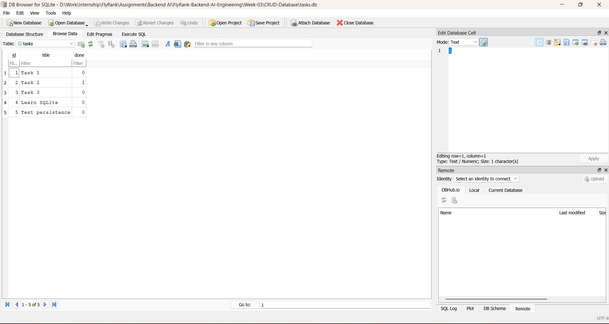

# SQLite Task CRUD API

A database-backed REST API built with **Python**, **FastAPI**, and **SQLite** for managing tasks.

This project was completed as part of the **FlyRank Backend AI Engineering Internship — Week 3, Assignment A2: Connecting Your CRUD to the Database**.

It continues the Week 2 CRUD API by replacing the temporary in-memory Python list with a persistent SQLite database while keeping the same CRUD endpoints and overall request/response behavior.

---

## What Changed from Week 2?

In Week 2, tasks were stored in a Python list:

```text
Client -> FastAPI -> In-memory Python list
```

Restarting the server caused newly created or updated data to disappear.

In Week 3, the storage layer was replaced with SQLite:

```text
Client -> FastAPI -> SQLite database (tasks.db)
```

The API endpoints remain the same, but task data now survives application restarts.

---

## Features

- Create new tasks
- List all tasks
- Retrieve a task by ID
- Update task title and/or completion status
- Delete tasks
- Persistent SQLite storage
- Automatic database creation
- Automatic `tasks` table creation
- Three example tasks seeded only when the table is empty
- Parameterized SQL queries
- Input validation
- JSON error responses
- Correct HTTP status codes
- Swagger UI documentation
- Database inspection using DB Browser for SQLite
- AI rematch comparison between a hand-built and AI-generated implementation

---

## Tech Stack

- Python 3.12
- FastAPI
- Uvicorn
- SQLite
- Python `sqlite3`
- DB Browser for SQLite
- Git
- GitHub

---

## Why SQLite?

SQLite was chosen because it is lightweight, requires no separate database server, and stores the database in a single file.

Python includes the `sqlite3` module in its standard library, so no additional database package is required.

Unlike the Week 2 in-memory list, SQLite provides persistence, meaning created and updated tasks remain available after the FastAPI server stops and starts again.

---

## Database

The application uses:

```text
tasks.db
```

The database is created automatically inside the Week 3 project directory when the application starts.

The database file itself is excluded from Git using `.gitignore`, so each cloned copy of the project creates its own fresh database automatically.

The application also creates the `tasks` table automatically if it does not already exist.

### Tasks Table

| Column | Type | Purpose |
|---|---|---|
| `id` | INTEGER | Primary key |
| `title` | TEXT | Task title |
| `done` | BOOLEAN | Completion status stored by SQLite as `0` or `1` |

If the table is empty when the application starts, three example tasks are inserted automatically.

---

## Project Structure

```text
CRUD-Database/
├── main.py
├── requirements.txt
├── README.md
├── screenshots/
│   └── database-browser.png
├── ai-version/
│   ├── main.py
│   ├── requirements.txt
│   └── prompt-v1.txt
└── ai-version-v2/
    ├── main.py
    ├── requirements.txt
    └── prompt-v2.txt
```

Generated SQLite files such as `tasks.db`, `tasks.db-journal`, `tasks.db-wal`, and `tasks.db-shm` are ignored by Git.

---

## Installation

### 1. Clone the repository

```bash
git clone https://github.com/Abdullah-Javed-01/FlyRank-Backend-AI-Engineering.git
cd FlyRank-Backend-AI-Engineering
```

### 2. Create a virtual environment

```bash
python -m venv .venv
```

### 3. Activate the environment

#### Windows PowerShell

```powershell
.\.venv\Scripts\Activate.ps1
```

#### macOS / Linux

```bash
source .venv/bin/activate
```

### 4. Install dependencies

```bash
pip install -r Week-03/CRUD-Database/requirements.txt
```

---

## Running the API

Move into the Week 3 project:

```bash
cd Week-03/CRUD-Database
```

Start the development server:

```bash
uvicorn main:app --reload
```

The API will run at:

```text
http://127.0.0.1:8000
```

Swagger UI is available at:

```text
http://127.0.0.1:8000/docs
```

On the first run, `tasks.db` and the `tasks` table are created automatically.

---

## API Endpoints

| Method | Endpoint | Description | Success Status |
|---|---|---|---|
| `GET` | `/` | API information | `200 OK` |
| `GET` | `/health` | Health check | `200 OK` |
| `GET` | `/tasks` | Return all tasks | `200 OK` |
| `GET` | `/tasks/{task_id}` | Return one task | `200 OK` |
| `POST` | `/tasks` | Create a task | `201 Created` |
| `PUT` | `/tasks/{task_id}` | Update a task | `200 OK` |
| `DELETE` | `/tasks/{task_id}` | Delete a task | `204 No Content` |

Invalid request bodies return:

```text
400 Bad Request
```

Unknown task IDs return:

```text
404 Not Found
```

---

## SQL Queries

All CRUD operations use SQL queries with parameterized placeholders instead of inserting user input directly into SQL strings.

Example:

```sql
SELECT id, title, done FROM tasks WHERE id = ?;
```

The task ID is supplied separately to the query.

Parameterized queries help prevent SQL injection and keep database access safer.

---

## SQL Explored Manually

The database was opened using **DB Browser for SQLite** and the following queries were executed manually:

```sql
SELECT * FROM tasks;
```

```sql
SELECT * FROM tasks WHERE done = 1;
```

```sql
SELECT COUNT(*) FROM tasks;
```

```sql
UPDATE tasks SET done = 1;
```

```sql
DELETE FROM tasks WHERE done = 1;
```

### Example SQL Query

```sql
SELECT * FROM tasks WHERE done = 1;
```

This query returned only tasks marked as completed, where SQLite stores the `done` value as `1`.

Changes made directly in DB Browser were visible through the FastAPI endpoints after the database transaction was committed, because both the API and DB Browser use the same SQLite database file.

---

## Database Screenshot

The screenshot below shows the `tasks` table opened in DB Browser for SQLite.



The screenshot includes tasks created through the API, demonstrating that the data was stored persistently in SQLite.

---

## Persistence Test

Persistence was tested by:

1. Creating new tasks through `POST /tasks`
2. Confirming them through `GET /tasks`
3. Stopping the FastAPI server
4. Restarting the server
5. Calling `GET /tasks` again

The created tasks remained available after the restart.

Database changes made manually through DB Browser were also verified through the API.

---

## Automatic Database Setup

A clean copy of the project requires no manual database setup.

When the application starts:

1. SQLite creates `tasks.db` if it does not exist.
2. The application creates the `tasks` table if it does not exist.
3. The application counts the existing rows.
4. If the table is empty, three example tasks are inserted.
5. If tasks already exist, no duplicate seed data is added.

This allows someone cloning the repository to start the API without manually creating the database.

---

eated the task using AI-generated versions in separate folders so my original Stages 0–5 implementation remained unchanged.

### Prompt V1

This was my first prompt, written from memory:

```text
I have internship task to test CRUD api.I want to you do it using pythin.
for task make sure you add checks for all possibble errors.
Than i want to make store data in SQLlite and i want you to check for if database file is missing on restart its regenrate and for initially have atleast 3 records.
```

The first AI-generated version was stored in:## Storage Layer Separation

The external API remains the same while the storage implementation changes.

```text
Week 2:
API -> Python list

Week 3:
API -> SQLite
```

This demonstrates an important backend engineering idea: the API describes what the application does, while the database is an implementation detail describing where the data is stored.


## A3 — Containerized PostgreSQL

### Stage 0 — PostgreSQL in Docker

A3 replaces the SQLite storage used in A2 with PostgreSQL running in Docker.

For local development, PostgreSQL 17 is started with a named Docker volume so database data survives container restarts:

```powershell
docker run --name taskdb -e POSTGRES_PASSWORD=dev -e POSTGRES_DB=tasks -p 5432:5432 -v taskdata:/var/lib/postgresql/data -d postgres:17
```

Verify the container:

```powershell
docker ps
```

Open PostgreSQL:

```powershell
docker exec -it taskdb psql -U postgres -d tasks
```

The named volume is:

```text
taskdata
```

PostgreSQL 17 is pinned rather than using `postgres:latest` because PostgreSQL 18+ changed the Docker image data-directory layout.
---

## AI vs Me — Bonus Stage 6

After completing the SQLite migration manually, I rep

```text
ai-version/
```

### V1 Testing

The AI V1 successfully:

- created a SQLite database automatically
- created three initial tasks
- avoided duplicate seed tasks after restart
- persisted newly created tasks after restart
- supported GET, POST, PUT, and DELETE
- returned `201` for successful creation
- returned `204` with an empty body for successful deletion

However, testing also revealed important differences from my hand-built API.

### Concrete Differences

#### 1. Invalid POST returned 422 instead of 400

My hand-built implementation returns:

```text
400 Bad Request
```

with:

```json
{"error":"Title is required"}
```

AI V1 returned:

```text
422 Unprocessable Entity
```

with FastAPI/Pydantic validation output:

```json
{
  "detail": [
    {
      "type": "missing",
      "loc": ["body", "title"],
      "msg": "Field required"
    }
  ]
}
```

This changed the API behavior from the original assignment.

#### 2. Error response format changed

For an unknown task ID, my implementation returns:

```json
{"error":"Task not found"}
```

AI V1 returned:

```json
{"detail":"Task not found"}
```

Both returned HTTP `404`, but the JSON response shape was different.

#### 3. New task completion status changed

My implementation always creates a new task with:

```json
"done": false
```

even if the client sends `done: true`.

AI V1 accepted the client's value.

For example:

```json
{
  "title": "Should start false",
  "done": true
}
```

was created by AI V1 with:

```text
done = True
```

This changed the original POST behavior.

### What the AI Did Better

AI V1 introduced several useful implementation ideas:

- Pydantic models for structured request validation
- a reusable `get_connection()` helper
- `sqlite3.Row` for named-column access
- a database constraint for `done`
- generic SQLite database error handling

These ideas made parts of the code more structured and defensive.

### What the AI Got Wrong or Changed

The AI produced working code, but it did not preserve the complete API contract.

It:

- returned `422` instead of `400` for normal validation errors
- used `{"detail": ...}` instead of the existing `{"error": ...}` error format
- allowed clients to create tasks with `done=true`
- made schema and validation decisions that were not explicitly requested

The implementation was technically reasonable, but some choices were incompatible with the existing API.

### What My First Prompt Forgot

My first prompt was too general.

I wrote:

```text
make sure you add checks for all possibble errors
```

but I did not specify:

- which errors should return `400`
- that normal validation errors should not return `422`
- the required JSON error shape
- that unknown IDs must return `404`
- that POST must always force `done=false`
- the exact CRUD endpoint behavior
- that DELETE must return `204` with an empty body
- that PUT must support title only, done only, or both

Because these details were missing, the AI silently made those decisions itself.

### Prompt V2 — Rematch

After reviewing V1, I improved the prompt:

```text
i want to test CRUDapi using python and fastapi and sqllite3.I must make database file tasks.db and it must regenrate if its missing after server restart in database make table that contain tittle, id, done status. for initially have atleast 3 records. and it seed should exactlr return 3 when table is empty. i wan you to add endposints like get tasks and get task by id and push task, update task, delete task. i also want you to add checks for tittle like if user enter no tittle it show eroor tittle is not found and error code and for done stautus if must remain flase even enter trun when cretaing new one.invalide request must return like invalide body request 400,do not return for normal invalide errors 422,unknown task id 404 like this. show erroe like error: "this is error", and delet must return 204 and empty body after delting. PUT must allow title only, done only, or both. and make sure data survive after restart.
```

The rematch version was stored in:

```text
ai-version-v2/
```

### Rematch Result

The improved prompt made the expected behavior much more explicit.

In V2:

- normal invalid request bodies returned `400` instead of `422`
- unknown task IDs returned `404` using the required `{"error": ...}` format
- new tasks stayed `done=false` even when the client supplied `done=true`
- PUT allowed title only, done only, or both
- DELETE returned `204` with an empty body
- data continued to survive server restarts
- the seed remained exactly three records when the table was empty

The rematch produced an implementation much closer to the intended API contract.

### What I Learned from the AI Rematch

The biggest lesson was that working code is not automatically correct code.

AI V1 produced a functional SQLite CRUD API, but because my first prompt did not fully describe the existing API contract, the AI made reasonable decisions that changed its behavior.

Building the migration manually first made it possible for me to recognize those differences.

The second prompt was much more precise because it was based on problems found through actual testing and comparison.

---

## What I Learned

Through this assignment I practiced:

- SQLite database fundamentals
- Persistent data storage
- SQL `SELECT`
- SQL `INSERT`
- SQL `UPDATE`
- SQL `DELETE`
- SQL `WHERE`
- SQL `COUNT`
- Primary keys
- Database tables, rows, and columns
- Parameterized SQL queries
- SQLite transactions
- Python's `sqlite3` module
- Inspecting databases with DB Browser for SQLite
- Separating the API layer from the storage layer
- Testing persistence across server restarts
- Incremental Git commits
- Reviewing AI-generated backend code
- Comparing implementations with `git diff`
- Improving prompts based on concrete test failures

---

## Development Stages

The database migration was implemented incrementally:

```text
Stage 0: create SQLite database
Stage 1: database read endpoints
Stage 2: insert into database
Stage 3: update and delete with SQL
Stage 4: explored SQLite
Stage 5: database documentation
Stage 6: AI vs me
```

---

## Author

**Abdullah Javed**

Backend AI Engineering Intern — FlyRank AI

- GitHub: [Abdullah-Javed-01](https://github.com/Abdullah-Javed-01)
- LinkedIn: [Abdullah Javed](https://www.linkedin.com/in/abdullah-javed-id01/)
