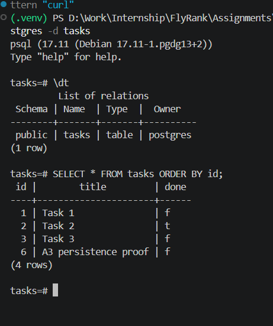

# Task CRUD API — PostgreSQL + Docker

A database-backed REST API built with **Python**, **FastAPI**, **PostgreSQL**, and **Docker Compose** for managing tasks.

This project is part of the **FlyRank Backend AI Engineering Internship** and continues the same CRUD API through three storage implementations:

```text
A1: FastAPI -> In-memory Python list
A2: FastAPI -> SQLite
A3: FastAPI -> PostgreSQL in Docker
```

The API contract stays the same while the storage implementation changes.

---

## Current Version — A3 Containerized PostgreSQL

The current version runs the FastAPI application against **PostgreSQL 17** in Docker.

The API and database start together with:

```powershell
docker compose up
```

PostgreSQL data is stored in a named Docker volume so it survives application and container restarts.

During the A3 SQLite → PostgreSQL storage swap, the FastAPI route layer in `main.py` remained unchanged. The storage implementation was isolated behind `repository.py`, so the actual database swap was handled in the repository and infrastructure/configuration files.

---

## What A3 Adds

- PostgreSQL 17 running in Docker
- Persistent named Docker volume
- PostgreSQL repository using `psycopg`
- Connection configuration through `.env`
- Committed `.env.example`
- `.env` excluded from Git
- Parameterized PostgreSQL queries using `%s`
- Automatic `tasks` table creation
- Three seed tasks inserted only when the table is empty
- Dockerfile for the FastAPI application
- Docker Compose stack with `api` and `db` services
- PostgreSQL health check
- One-command startup with `docker compose up`
- Persistence verified across `docker compose down` → `docker compose up`
- Existing CRUD routes, validation rules, error shape, and status codes preserved

---

## Architecture

```text
Client / curl / Swagger
          |
          v
  localhost:8000
          |
          v
+-----------------------+
| FastAPI API container |
|        api            |
|                       |
|       main.py         |
|          |            |
|          v            |
|    repository.py      |
+----------|------------+
           |
           | DATABASE_URL
           | host = db
           v
+-----------------------+
| PostgreSQL 17         |
| service: db           |
| database: tasks       |
+----------|------------+
           |
           v
   taskdata volume
```

Inside the Docker Compose network, the API reaches PostgreSQL using the Compose service hostname `db`, not `localhost`.

---

## Tech Stack

- Python 3.12
- FastAPI
- Uvicorn
- PostgreSQL 17
- `psycopg`
- `python-dotenv`
- Docker
- Docker Compose
- Git
- GitHub

Previous A2 tools retained as project history:

- SQLite
- Python `sqlite3`
- DB Browser for SQLite

---

## Project Structure

```text
CRUD-Database/
├── .dockerignore
├── .env                  # local only, ignored by Git
├── .env.example          # committed template
├── Dockerfile
├── compose.yaml
├── main.py               # FastAPI routes / validation
├── repository.py         # PostgreSQL storage implementation
├── requirements.txt
├── README.md
├── screenshots/
│   ├── database-browser.png
│   └── postgres-persistence.png
├── ai-version/           # A2 AI rematch V1
│   ├── main.py
│   ├── requirements.txt
│   └── prompt-v1.txt
└── ai-version-v2/        # A2 AI rematch V2
    ├── main.py
    ├── requirements.txt
    └── prompt-v2.txt
```

Local SQLite files from A2 and environment secrets are excluded through `.gitignore`.

---

# Quick Start — A3

## 1. Clone the repository

```bash
git clone https://github.com/Abdullah-Javed-01/FlyRank-Backend-AI-Engineering.git
cd FlyRank-Backend-AI-Engineering/Week-03/CRUD-Database
```

## 2. Create `.env` from the example

### Windows PowerShell

```powershell
Copy-Item .env.example .env
```

### macOS / Linux

```bash
cp .env.example .env
```

The example file contains the required variables:

```env
POSTGRES_USER=postgres
POSTGRES_PASSWORD=CHANGE_ME
POSTGRES_DB=tasks
DATABASE_URL=postgresql://postgres:CHANGE_ME@db:5432/tasks
```

For local development, replace `CHANGE_ME` with any local database password you want to use. The value in `POSTGRES_PASSWORD` and the password inside `DATABASE_URL` must match.

## 3. Start the complete stack

```powershell
docker compose up
```

Docker Compose starts:

- the FastAPI application on port `8000`
- PostgreSQL 17 on port `5432`
- the persistent `taskdata` volume

The API is available at:

```text
http://127.0.0.1:8000
```

Swagger UI:

```text
http://127.0.0.1:8000/docs
```

To stop the stack:

```powershell
docker compose down
```

Do not add `-v` if you want to keep the PostgreSQL data.

---

## API Endpoints

| Method | Endpoint | Description | Success Status |
|---|---|---|---|
| `GET` | `/` | API information | `200 OK` |
| `GET` | `/health` | API health check | `200 OK` |
| `GET` | `/tasks` | Return all tasks | `200 OK` |
| `GET` | `/tasks/{task_id}` | Return one task | `200 OK` |
| `POST` | `/tasks` | Create a new task | `201 Created` |
| `PUT` | `/tasks/{task_id}` | Update title and/or done status | `200 OK` |
| `DELETE` | `/tasks/{task_id}` | Delete a task | `204 No Content` |

Invalid request bodies return:

```text
400 Bad Request
```

Unknown task IDs return:

```text
404 Not Found
```

with the existing JSON error format:

```json
{"error":"Task not found"}
```

---

## Example `curl -i`

Verified request:

```powershell
curl.exe -i http://127.0.0.1:8000/tasks
```

Verified response:

```text
HTTP/1.1 200 OK
server: uvicorn
content-type: application/json

[{"id":1,"title":"Task 1","done":false},{"id":2,"title":"Task 2","done":true},{"id":3,"title":"Task 3","done":false}]
```

---

## PostgreSQL Table

The repository automatically creates:

```sql
CREATE TABLE IF NOT EXISTS tasks (
    id SERIAL PRIMARY KEY,
    title TEXT NOT NULL,
    done BOOLEAN NOT NULL DEFAULT FALSE
);
```

If the table is empty, the application inserts exactly three example tasks:

```text
1 | Task 1 | false
2 | Task 2 | true
3 | Task 3 | false
```

Restarting the app does not create duplicate seed rows because the repository checks the current task count first.

---

## Parameterized Queries

All user-controlled values are passed separately from the SQL string.

Example:

```python
cursor.execute(
    "SELECT id, title, done FROM tasks WHERE id = %s",
    (task_id,),
)
```

The same approach is used for `INSERT`, `UPDATE`, and `DELETE`.

This avoids building SQL statements by concatenating user input directly into the query.

---

# A3 Verification

## Stage 0 — PostgreSQL in Docker

PostgreSQL was first started as a standalone Docker container with a persistent named volume:

```powershell
docker run --name taskdb -e POSTGRES_PASSWORD=dev -e POSTGRES_DB=tasks -p 5432:5432 -v taskdata:/var/lib/postgresql/data -d postgres:17
```

Verified with:

```powershell
docker ps
docker volume ls
docker exec -it taskdb psql -U postgres -d tasks
```

`postgres:17` is pinned because PostgreSQL 18+ changed the Docker image data-directory layout. PostgreSQL 17 remains compatible with the assignment's `/var/lib/postgresql/data` volume path.

---

## Repository Boundary

Before the PostgreSQL swap, the A2 SQLite database code was moved into `repository.py`.

The route and validation layer remained in `main.py`.

```text
main.py
   |
   v
repository.py
   |
   +--> A2: SQLite
   |
   +--> A3: PostgreSQL
```

After the repository boundary existed, `main.py` stayed unchanged during the SQLite → PostgreSQL storage swap.

This demonstrates that storage is an implementation detail behind the API.

---

## Stage 1 — Connect via `.env` and Create the Table

The PostgreSQL connection string is loaded from:

```text
.env
```

The real `.env` file is ignored by Git, while `.env.example` documents the required configuration.

The repository:

1. connects with `psycopg`
2. creates the `tasks` table if missing
3. checks the number of rows
4. seeds the three example tasks only when the table is empty

The app was restarted multiple times and the table remained at exactly three seed rows:

```text
1 | Task 1 | false
2 | Task 2 | true
3 | Task 3 | false
```

---

## Stage 2 — Read from PostgreSQL

The existing read endpoints were verified against PostgreSQL.

Verified behavior:

- `GET /tasks` → `200 OK`
- `GET /tasks/1` → `200 OK`
- `GET /tasks/999` → `404 Not Found`
- unknown task response → `{"error":"Task not found"}`

The task ID lookup uses a parameterized `%s` placeholder.

Direct PostgreSQL inspection showed the same rows returned by the API.

---

## Stage 3 — Full CRUD on PostgreSQL

The complete CRUD cycle was tested against PostgreSQL.

Verified status codes:

| Test | Result |
|---|---|
| Create task | `201 Created` |
| Update task | `200 OK` |
| Read updated task | `200 OK` |
| Delete task | `204 No Content` |
| Read deleted task | `404 Not Found` |
| Create with empty title | `400 Bad Request` |

Verified validation response:

```json
{"error":"Title is required"}
```

Verified unknown task response:

```json
{"error":"Task not found"}
```

The temporary CRUD test rows were deleted afterward.

---

## Stage 4 — Docker Compose and Persistence

The FastAPI application and PostgreSQL database now run together with Docker Compose.

The complete stack starts with:

```powershell
docker compose up
```

The Compose stack contains:

- `api` — FastAPI on port `8000`
- `db` — PostgreSQL 17
- `taskdata` — named persistent volume

The database service also has a PostgreSQL health check, and the API waits for the database to become healthy.

### Persistence Check

Persistence was verified by:

1. starting the stack with `docker compose up`
2. creating a task named `A3 persistence proof`
3. confirming it through `GET /tasks`
4. running `docker compose down`
5. verifying the named Docker volume still existed
6. starting the complete stack again with `docker compose up`
7. calling `GET /tasks` again
8. querying PostgreSQL directly with `psql`

The persistence row remained after both containers were recreated.

Direct PostgreSQL result:

```text
 id |        title         | done
----+----------------------+------
  1 | Task 1               | f
  2 | Task 2               | t
  3 | Task 3               | f
  6 | A3 persistence proof | f
```

### PostgreSQL Persistence Screenshot



The screenshot shows both the `tasks` table and the persisted `A3 persistence proof` row after the full-stack restart.

---

## Stage 5 — One-Command Stack and Documentation

A clean setup requires no manual PostgreSQL installation or table creation.

The expected workflow is:

```powershell
Copy-Item .env.example .env
docker compose up
```

On macOS/Linux:

```bash
cp .env.example .env
docker compose up
```

After startup:

```powershell
curl.exe -i http://127.0.0.1:8000/tasks
```

returns the seeded tasks.

No manual SQL setup is required because the repository creates and seeds the table automatically.

---

## Secrets and Git Safety

The real `.env` file is excluded from Git.

Verified locally with:

```powershell
git check-ignore -v .env
```

The file is not tracked:

```powershell
git ls-files .env
```

and no `.env` commit exists in the repository history:

```powershell
git log --all --full-history -- .env
```

Only `.env.example` is committed.

The Docker build context also excludes `.env` through `.dockerignore`.

---

# A2 History — SQLite Version

Before A3, the same API used SQLite for Assignment A2.

The storage progression was:

```text
A1:
API -> Python list

A2:
API -> SQLite tasks.db

A3:
API -> PostgreSQL container
```

A2 introduced:

- persistent SQLite storage
- automatic `tasks.db` creation
- automatic table creation
- seed-once behavior
- SQL CRUD queries
- parameterized SQLite placeholders
- DB Browser inspection
- persistence across application restarts

The SQLite database itself is ignored by Git.

### A2 Database Screenshot


The screenshot shows rows stored in the SQLite database during A2.

---

# A2 AI vs Me — Bonus Stage 6

For the optional A2 AI rematch, the manually built SQLite implementation remained untouched while AI-generated versions were created in separate folders.

## Prompt V1

```text
I have internship task to test CRUD api.I want to you do it using pythin.
for task make sure you add checks for all possibble errors.
Than i want to make store data in SQLlite and i want you to check for if database file is missing on restart its regenrate and for initially have atleast 3 records.
```

The first AI-generated version was stored in:

```text
ai-version/
```

### V1 Findings

The first AI version successfully:

- created a SQLite database automatically
- seeded three initial tasks
- avoided duplicate seeds after restart
- persisted created tasks
- supported CRUD
- returned `201` on creation
- returned `204` on successful deletion

However, it changed parts of the API contract.

### Concrete Differences

#### 1. Invalid POST

Hand-built version:

```text
400 Bad Request
```

```json
{"error":"Title is required"}
```

AI V1 returned FastAPI/Pydantic `422 Unprocessable Entity`.

#### 2. Error Shape

Hand-built version:

```json
{"error":"Task not found"}
```

AI V1:

```json
{"detail":"Task not found"}
```

#### 3. POST `done` Behavior

The hand-built implementation always creates new tasks with:

```json
"done": false
```

AI V1 allowed the client to create a task with `done=true`.

### What AI V1 Did Better

AI V1 introduced some useful ideas:

- Pydantic request models
- reusable connection helper
- `sqlite3.Row`
- additional database constraints
- generic database error handling

### What the First Prompt Forgot

The first prompt did not specify:

- exact `400` validation behavior
- that normal validation should not become `422`
- required `{"error": ...}` response shape
- unknown ID → `404`
- POST must force `done=false`
- exact endpoint behavior
- DELETE → `204` with empty body
- PUT must allow title only, done only, or both

Because these details were missing, the AI made reasonable but incompatible decisions.

---

## Prompt V2 — Rematch

```text
i want to test CRUDapi using python and fastapi and sqllite3.I must make database file tasks.db and it must regenrate if its missing after server restart in database make table that contain tittle, id, done status. for initially have atleast 3 records. and it seed should exactlr return 3 when table is empty. i wan you to add endposints like get tasks and get task by id and push task, update task, delete task. i also want you to add checks for tittle like if user enter no tittle it show eroor tittle is not found and error code and for done stautus if must remain flase even enter trun when cretaing new one.invalide request must return like invalide body request 400,do not return for normal invalide errors 422,unknown task id 404 like this. show erroe like error: "this is error", and delet must return 204 and empty body after delting. PUT must allow title only, done only, or both. and make sure data survive after restart.
```

The rematch version was stored in:

```text
ai-version-v2/
```

### V2 Result

The improved prompt produced a version much closer to the intended API contract:

- invalid request bodies returned `400`
- unknown IDs returned `404`
- errors used `{"error": ...}`
- new tasks remained `done=false`
- PUT accepted title only, done only, or both
- DELETE returned `204` with an empty body
- data survived restart
- seed behavior remained exactly three rows on an empty table

### A2 AI Rematch Lesson

Working code is not automatically correct code.

The first AI version was functional, but the prompt did not fully specify the existing API contract. Building and testing the assignment manually first made it possible to identify the differences and write a much stronger second prompt.

---

# What I Learned

Across A2 and A3, I practiced:

- FastAPI CRUD development
- HTTP status codes
- validation and JSON error responses
- SQL `SELECT`, `INSERT`, `UPDATE`, and `DELETE`
- parameterized SQL
- SQLite persistence
- PostgreSQL fundamentals
- PostgreSQL `SERIAL` primary keys
- `psycopg`
- environment variables and `.env`
- secrets management with `.gitignore`
- repository/storage separation
- Docker images and containers
- Docker volumes
- Dockerfiles
- Docker Compose
- service-to-service networking
- PostgreSQL health checks
- persistence across full container recreation
- incremental Git commits
- reviewing AI-generated backend code
- improving prompts based on concrete test failures

The most important architecture lesson was that the external API can remain stable while the storage engine changes underneath it.

---

# Development History

A3 was completed incrementally with one honest commit per stage:

```text
Stage 0: Postgres in Docker + gitignore
Refactor: extract database repository boundary
Stage 1: connect via .env and create table
Stage 2: verify reads from Postgres
Stage 3: full CRUD on Postgres
Stage 4: docker-compose the whole stack
Stage 5: one-command stack + docs
```

---

# Author

**Abdullah Javed**

Backend AI Engineering Intern — FlyRank AI

- GitHub: [Abdullah-Javed-01](https://github.com/Abdullah-Javed-01)
- LinkedIn: [Abdullah Javed](https://www.linkedin.com/in/abdullah-javed-id01/)
