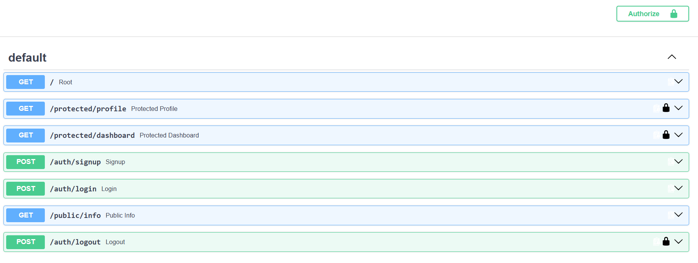

# FlyRank A4 — Auth · Login & Protect

Secure authentication API built for the **FlyRank Backend AI Engineering Internship — Assignment BE-03**.

This project demonstrates a complete authentication flow using **FastAPI** and **Supabase Auth**, including user signup, login, logout, JWT verification, reusable route protection, and Swagger UI Bearer authentication.

## Features

* User signup with Supabase Auth
* User login with JWT access and refresh tokens
* Protected API routes
* Supabase JWT verification
* Reusable FastAPI authentication dependency
* Public and authenticated endpoints
* Logout endpoint
* Swagger UI Bearer authentication
* Proper HTTP status codes and JSON error responses
* Environment-variable based configuration
* Secrets excluded from Git
* Additional protected dashboard route demonstrating dependency reuse

## Tech Stack

* Python 3.12
* FastAPI
* Uvicorn
* Supabase Auth
* Supabase Python SDK
* python-dotenv
* HTTP Bearer Authentication
* Git / GitHub

## Project Structure

```text
Auth-Login-Protect/
├── screenshots/
│   └── swagger-auth.png
├── .env.example
├── .gitignore
├── main.py
├── README.md
└── requirements.txt
```

The real `.env` file is intentionally excluded from Git.

## Authentication Flow

```text
User
  ↓
POST /auth/signup or /auth/login
  ↓
Supabase Auth
  ↓
JWT Access Token
  ↓
Authorization: Bearer <token>
  ↓
FastAPI HTTPBearer dependency
  ↓
Supabase verifies token
  ↓
Protected route executes
```

Passwords are never stored or hashed by this application. Account management, password hashing, and token issuance are handled by Supabase Auth.

## Environment Setup

### 1. Clone the repository

```bash
git clone https://github.com/Abdullah-Javed-01/FlyRank-Backend-AI-Engineering.git
```

Move into the assignment directory:

```bash
cd FlyRank-Backend-AI-Engineering/Week-04/Auth-Login-Protect
```

### 2. Create a virtual environment

Windows:

```powershell
python -m venv .venv
.\.venv\Scripts\Activate.ps1
```

macOS/Linux:

```bash
python -m venv .venv
source .venv/bin/activate
```

### 3. Install dependencies

```bash
python -m pip install -r requirements.txt
```

### 4. Configure Supabase

Create a Supabase project and obtain:

* Project URL
* `anon` / public API key

Do **not** use the `service_role` key for this application.

Create a `.env` file based on `.env.example`:

```env
SUPABASE_URL=your_project_url
SUPABASE_KEY=your_anon_key
PORT=8000
```

The real `.env` file is ignored by Git and must never be committed.

## Run the API

Start the development server with:

```bash
python -m uvicorn main:app --reload --port 8000
```

The API will be available at:

```text
http://127.0.0.1:8000
```

Swagger UI:

```text
http://127.0.0.1:8000/docs
```

## API Reference

| Method | Endpoint               | Purpose                               | Authentication | Success |
| ------ | ---------------------- | ------------------------------------- | -------------- | ------: |
| `GET`  | `/`                    | API health/root response              | No             |   `200` |
| `POST` | `/auth/signup`         | Register a new user                   | No             |   `201` |
| `POST` | `/auth/login`          | Authenticate and receive tokens       | No             |   `200` |
| `POST` | `/auth/logout`         | End authenticated session             | Bearer JWT     |   `204` |
| `GET`  | `/public/info`         | Read public information               | No             |   `200` |
| `GET`  | `/protected/profile`   | Read authenticated user profile       | Bearer JWT     |   `200` |
| `GET`  | `/protected/dashboard` | Demonstrate reusable route protection | Bearer JWT     |   `200` |

## Status Codes

The API uses the following status codes:

| Status | Meaning      | Example                                       |
| -----: | ------------ | --------------------------------------------- |
|  `200` | OK           | Login or protected route succeeded            |
|  `201` | Created      | User signup succeeded                         |
|  `204` | No Content   | Logout succeeded                              |
|  `400` | Bad Request  | Required signup/login input missing           |
|  `401` | Unauthorized | Missing, malformed, invalid, or expired token |

Example missing credentials response:

```json
{
  "error": "Email and password are required"
}
```

Example invalid login response:

```json
{
  "error": "Invalid login credentials"
}
```

Example missing Bearer token response:

```json
{
  "error": "Access token required"
}
```

Example invalid or tampered JWT response:

```json
{
  "error": "Invalid or expired token"
}
```

## Signup

Request:

```http
POST /auth/signup
Content-Type: application/json
```

```json
{
  "email": "user@example.com",
  "password": "password123"
}
```

A successful request returns:

```text
201 Created
```

Supabase Auth manages the account and password securely.

## Login

Request:

```http
POST /auth/login
Content-Type: application/json
```

```json
{
  "email": "user@example.com",
  "password": "password123"
}
```

A successful login returns:

```json
{
  "access_token": "<jwt>",
  "refresh_token": "<refresh-token>"
}
```

The access token is used to authenticate protected requests.

## Protected Routes

Protected routes require:

```http
Authorization: Bearer <access_token>
```

The reusable `get_current_user` FastAPI dependency:

1. Reads Bearer credentials through `HTTPBearer`.
2. Rejects missing or malformed authentication.
3. Sends the JWT to Supabase Auth for verification.
4. Rejects invalid, modified, or expired tokens.
5. Returns the verified Supabase user to the route handler.

Both `/protected/profile` and `/protected/dashboard` use the same dependency, avoiding duplicated authentication logic.

## JWT Verification

Tokens are not trusted merely because they are present.

The API verifies each protected request using:

```python
supabase.auth.get_user(token)
```

A valid token allows the protected route to execute.

A tampered, expired, or otherwise invalid token returns:

```text
401 Unauthorized
```

## Swagger UI Bearer Authentication

FastAPI exposes interactive API documentation at:

```text
http://127.0.0.1:8000/docs
```

Protected routes use FastAPI's `HTTPBearer` security scheme.

To test authentication:

1. Run `POST /auth/login`.
2. Copy the returned `access_token`.
3. Click **Authorize** in Swagger UI.
4. Paste the raw JWT access token.
5. Click **Authorize**.
6. Run `GET /protected/profile`.
7. Swagger automatically adds the `Authorization: Bearer <token>` header.

### Swagger UI



The lock icons indicate endpoints protected by Bearer authentication.

## Verified Test Cases

The following behavior was tested successfully:

```text
Signup with valid credentials            → 201 Created
Signup with missing password             → 400 Bad Request

Login with valid credentials             → 200 OK
Login with incorrect password            → 401 Unauthorized
Login with missing password              → 400 Bad Request

Public information endpoint              → 200 OK

Protected profile without token          → 401 Unauthorized
Protected profile with valid JWT         → 200 OK
Protected profile with tampered JWT      → 401 Unauthorized

Protected dashboard with valid JWT       → 200 OK
Protected dashboard with tampered JWT    → 401 Unauthorized

Logout without token                     → 401 Unauthorized
Logout with valid JWT                    → 204 No Content

Swagger Bearer authorization             → Working
Swagger protected profile request        → 200 OK
```

## Security Decisions

### No passwords stored locally

The application forwards credentials to Supabase Auth. Password storage and hashing are handled by the identity provider.

### No `service_role` key

The application uses the Supabase public/anon key. The privileged `service_role` key is not used.

### Secrets kept outside source code

Real Supabase configuration is stored in:

```text
.env
```

The file is excluded through `.gitignore`.

Only `.env.example` is committed.

### JWTs are verified

Protected endpoints do not trust arbitrary Bearer strings. Tokens are verified against Supabase before access is granted.

### Reusable authentication dependency

Authentication logic is implemented once and reused by multiple protected routes.

This reduces duplication and lowers the risk of accidentally leaving a protected endpoint unsecured.

## Git Security Verification

Before publication, the repository was checked to confirm that `.env`:

* is not tracked by Git;
* is ignored by `.gitignore`;
* does not appear anywhere in Git history.

No Supabase secrets are committed to the repository.

## Assignment Stages

The project was developed incrementally with one Git commit per stage:

```text
Stage 0: setup server and supabase client
Stage 1: signup and login routes working
Stage 2: public route and unverified protected route
Stage 3: profile route token verification
Stage 4: auth middleware and logout endpoint
Stage 5: Swagger UI documentation with bearer auth
Stage 6: publish to GitHub and write README
```

This provides a clear history of how the authentication system evolved from initial setup to a fully protected API.

## Repository

[FlyRank Backend AI Engineering](https://github.com/Abdullah-Javed-01/FlyRank-Backend-AI-Engineering)

## Assignment

**FlyRank Internship — Backend AI Engineering**
**BE-03 — Auth · Login & Protect**
**Week 4**
